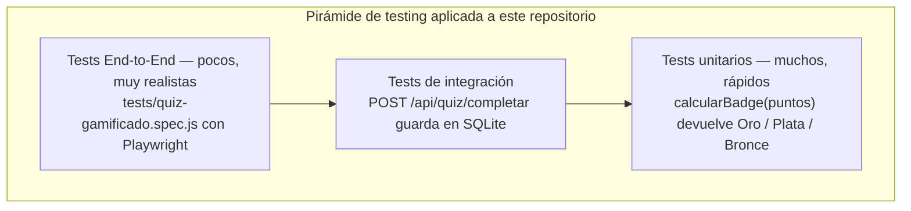
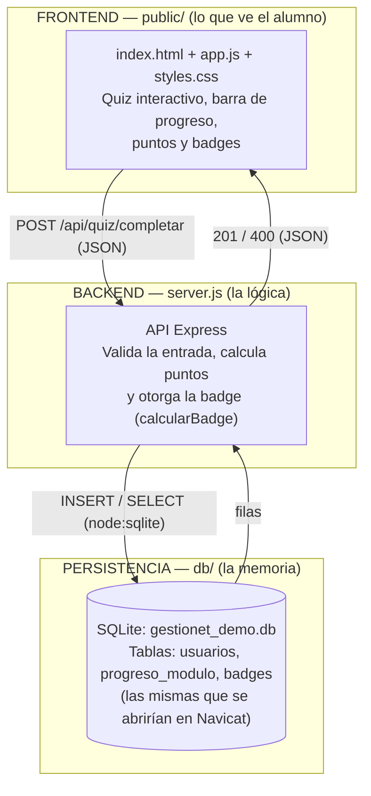
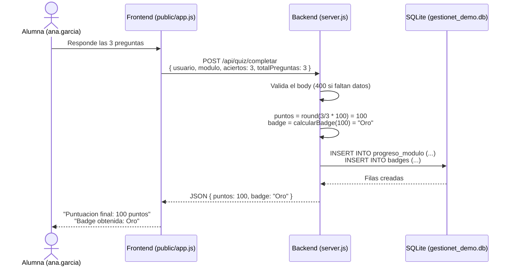
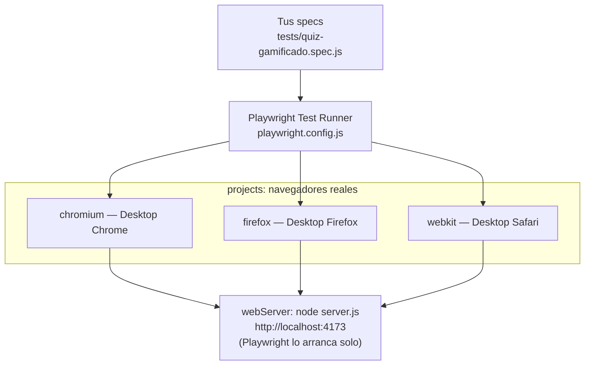
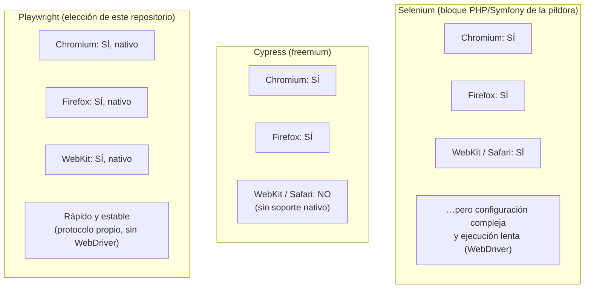
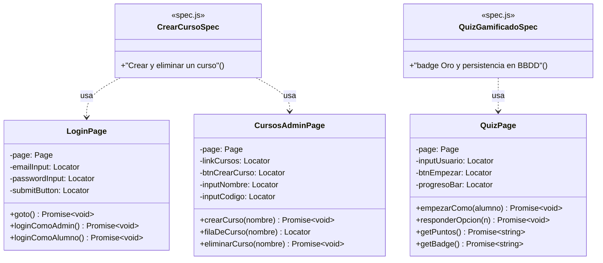
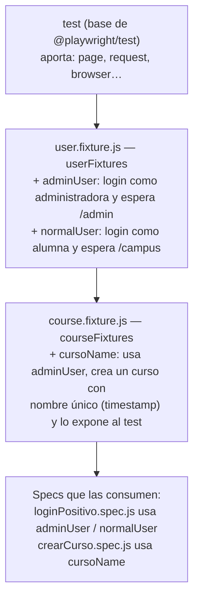
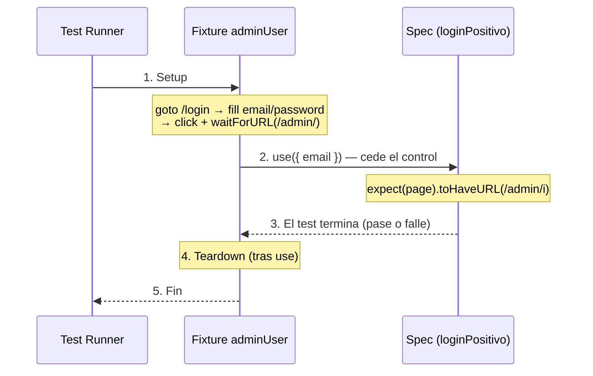
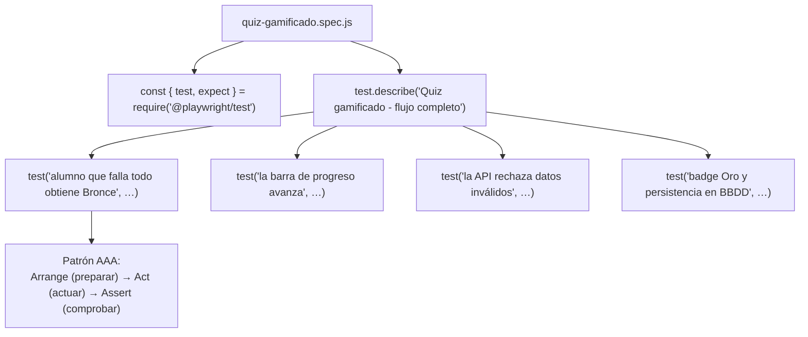
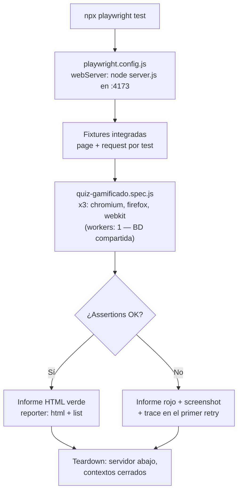

# Playwright en la Píldora de Testing Gestionet

## Guía didáctica para iniciados en desarrollo Full-Stack, adaptada al repositorio `MirelSIG/Pildora-Testing-Gestionet`

> **Audiencia:** personas que se inician en el desarrollo web full-stack y desean comprender cómo se automatizan las pruebas de una plataforma de formación telemática interactiva y gamificada (frontend, backend y persistencia).
>
> **Método:** deductivo — partiremos de los conceptos más generales (¿qué es probar software?) para descender progresivamente hasta lo más específico: **el código real que vive en este repositorio**, sus fixtures, sus ficheros `.spec.js` y la propuesta de evolución hacia Page Object Model.
>
> **Nota:** este material acompaña a un ejercicio formativo simulado del Bootcamp en Desarrollo Web Fullstack de Peñascal F5. Ningún contenido representa datos, sistemas o procesos reales de Gestionet; su nombre se usa únicamente como caso de estudio didáctico.

---

## Los dos proyectos del repositorio que recorreremos

| Proyecto | Qué es | Qué demuestra |
|---|---|---|
| `demo-playwright/` | Demo funcional autocontenida: quiz gamificado (puntos, badges, barra de progreso) con frontend propio, API Express y persistencia en SQLite | El ciclo completo UI → API → BBDD probado con Playwright en 3 navegadores |
| `easylearning-admin-e2e-main/` | Suite E2E real contra el panel de administración de una plataforma de e-learning (entorno de desarrollo) | Fixtures encadenadas, specs organizados por funcionalidad y ejecución en CI con GitHub Actions |

---

## Índice

1. Nivel 1 — Lo general: ¿por qué probamos una plataforma de formación gamificada?
2. Nivel 2 — El contexto: la demo del quiz es un sistema full-stack en miniatura
3. Nivel 3 — La herramienta: Playwright, y por qué se eligió frente a Cypress y Selenium
4. Nivel 4 — La arquitectura propuesta: Page Object Model (POM) como evolución del repositorio
5. Nivel 5 — El pegamento real: las fixtures de `easylearning-admin-e2e-main`
6. Nivel 6 — Lo específico: los ficheros `.spec.js` del repositorio
7. Nivel 7 — Caso práctico completo: el test del quiz gamificado (badge Oro + persistencia)
8. Glosario
9. Cómo ejecutar los tests del repositorio

---

# Nivel 1 — Lo general: ¿por qué probamos una plataforma de formación gamificada?

Imagina que la plataforma de formación despliega una mejora un lunes. El martes, un alumno completa el quiz de *Fundamentos de testing* acertando todo… y recibe la badge **Bronce** en lugar de la **Oro**. Nadie rompió el cálculo a propósito: alguien tocó otra cosa y, sin saberlo, alteró las reglas de puntuación. Eso es una **regresión**: algo que funcionaba deja de funcionar por un cambio en otra parte.

En un producto gamificado el riesgo es doble: no basta con que "no haya errores"; el progreso, los puntos y las badges son **la motivación del alumno**. Un fallo ahí destruye la experiencia aunque técnicamente "la página cargue".

**Probar software es verificar, de forma sistemática y automatizada, que la aplicación hace lo que debe.** Y las pruebas se organizan en niveles:



| Nivel | Qué prueba | Ejemplo real en el repositorio |
|---|---|---|
| **Unitario** | Una pieza aislada | ¿`calcularBadge(100)` devuelve `'Oro'`? (regla definida en `server.js`: Oro ≥ 100, Plata ≥ 60, Bronce ≥ 0) |
| **Integración** | Piezas colaborando | ¿`POST /api/quiz/completar` inserta la fila en la tabla `progreso_modulo` de SQLite? |
| **E2E** | El sistema completo | ¿Un alumno responde el quiz en el navegador, ve "Badge obtenida: Oro" y ese dato queda persistido? |

**Idea clave:** los tests E2E de Playwright que contiene este repositorio atraviesan toda la cadena —navegador → frontend → Express → SQLite— exactamente igual que lo haría un alumno real. La píldora los complementa con la inspección manual de la base de datos mediante **Navicat**, cerrando el círculo de validación.

---

# Nivel 2 — El contexto: la demo del quiz es un sistema full-stack en miniatura

Antes de probar algo hay que entender qué estamos probando. La carpeta `demo-playwright/` implementa, en pequeño, las mismas tres capas que cualquier plataforma de formación telemática (donde el producto real usaría Vue.js en el frontend y PHP/Symfony en el backend, como recoge la píldora):



## 2.1 Un flujo real del repositorio: "completar el quiz"

Cuando la alumna `ana.garcia` responde las tres preguntas del quiz y acierta todas, esto es lo que ocurre por debajo (código real de `server.js` y `db/database.js`):



**Reflexión importante:** si cualquiera de estos eslabones falla —un `data-testid` mal conectado en `app.js`, la fórmula de puntos alterada en `server.js`, una restricción incumplida en `progreso_modulo`—, Ana no recibe su Oro. Por eso el test E2E del repositorio verifica **el resultado final de la cadena completa**, y además comprueba la persistencia consultando la API que lee de la base de datos.

---

# Nivel 3 — La herramienta: Playwright, y por qué se eligió frente a Cypress y Selenium

**Playwright** es la biblioteca de código abierto (Microsoft) que este repositorio usa para **controlar navegadores reales mediante código**. Los tests escriben guiones como: "abre el quiz, escribe el nombre del alumno, pulsa Empezar, responde, comprueba la badge".

## 3.1 Cómo controla Playwright los navegadores en este repositorio

La configuración real de `demo-playwright/playwright.config.js` declara **tres proyectos**, uno por motor:



Dos decisiones reales del fichero que conviene entender:

```javascript
// demo-playwright/playwright.config.js (extracto real)
fullyParallel: false,  // Los tests comparten la misma BD…
workers: 1,            // …un único worker evita condiciones de carrera
projects: [
  { name: 'chromium', use: { ...devices['Desktop Chrome'] } },
  { name: 'firefox',  use: { ...devices['Desktop Firefox'] } },
  { name: 'webkit',   use: { ...devices['Desktop Safari'] } },
],
webServer: { command: 'node server.js', url: baseURL, ... },
```

- **`webServer`**: Playwright levanta el backend automáticamente antes de testear, igual que haría un pipeline de CI/CD. No hace falta arrancar nada a mano.
- **`workers: 1`**: el paralelismo de Playwright es real, pero aquí se limita a propósito porque todos los tests escriben en la misma SQLite. Es un buen ejemplo de que el paralelismo se ajusta al diseño de datos, no al revés.

## 3.2 Conceptos básicos que verás en los specs del repositorio

| Concepto | Qué es | Ejemplo real del repositorio |
|---|---|---|
| `page` | La pestaña que Playwright controla | `await page.goto('/')` |
| **Locator** | Forma de "señalar" un elemento | `page.getByTestId('btn-empezar')`, `page.getByRole('button', { name: 'Eliminar' })` |
| **Assertion** | Comprobación que pasa o falla | `await expect(page.getByTestId('resultado-badge')).toHaveText('Badge obtenida: Oro')` |
| `request` | Cliente HTTP para hablar con la API sin navegador | `await request.post('/api/quiz/completar', { data: {...} })` |

## 3.3 Playwright frente a sus principales equivalentes: Cypress y Selenium

La tabla de herramientas de la píldora incluye tres opciones para "recorrer la aplicación como un usuario real": **Selenium**, **Cypress** y **Playwright**. Un alumno puede abrir el campus desde Chrome, Firefox o Safari; un fallo que solo ocurre en Safari sigue siendo un fallo. Por eso el criterio decisivo es el soporte de **los tres motores reales**:



- **Cypress NO ejecuta en los 3 navegadores**: cubre Chromium y Firefox, pero carece de soporte nativo de WebKit, el motor de Safari. Además, su modelo es **freemium**: el paralelismo completo pasa por su nube de pago.
- **Selenium SÍ ejecuta en los 3** y es el veterano del sector, pero paga un precio: arquitectura WebDriver, configuración compleja (drivers por navegador, esperas manuales) y ejecución lenta.
- **Playwright SÍ ejecuta en los 3, de forma nativa, rápida y estable**: habla directamente con cada motor mediante su propio protocolo, sin intermediarios. La prueba está en este repositorio: los mismos specs corren en Chromium, Firefox y WebKit con tres líneas de configuración.

### Tabla comparativa detallada

| Criterio | Selenium | Cypress | **Playwright** |
|---|---|---|---|
| Chromium / Firefox / WebKit | Sí / Sí / Sí | Sí / Sí / **No** | **Sí / Sí / Sí (nativo)** |
| Paralelismo | Configuración manual (Grid) | Completo solo en su Cloud de pago | **Real e integrado de serie (workers)** |
| Esperas (waits) | Manuales y explícitas | Automáticas con limitaciones | **Auto-wait inteligente** |
| API | Verbosa, estilo clásico | Moderna pero atada a su runner | **Moderna, `async/await` estándar** |
| Fixtures integradas | No | Limitadas | **Sí: `user.fixture.js` y `course.fixture.js` de este repo las usan** |
| Testing de API | No integrado | Parcial (`cy.request`) | **Integrado (`request`): el spec del quiz lo usa para validar la persistencia** |
| Grabador de tests | Selenium IDE (básico) | Cypress Studio (limitado) | **Codegen avanzado con locators accesibles** |
| Depuración | Logs y capturas | Buen runner visual | **Trace Viewer + `screenshot: 'only-on-failure'` y `video: 'retain-on-failure'` (config real del repo)** |
| Licencia | Libre | Freemium | **Libre / Open source** |
| Estabilidad | Propensa a *flakiness* | Buena en Chromium | **Superior: protocolo directo; el repo además configura `retries: 2` en CI** |

### ¿Por qué Playwright es más potente para este caso?

Playwright reúne exactamente lo que una plataforma de formación gamificada necesita: **paralelismo real** (aquí regulado conscientemente con `workers`), **multi-browser real** (los 3 motores en la config), **auto-wait inteligente** (los specs no contienen `sleep`), **API moderna** con `async/await`, **fixtures** integradas (Nivel 5), **testing de API** incorporado (el quiz valida el 400 de entrada inválida), **grabador avanzado** (Codegen para generar primeros tests navegando) y **estabilidad superior** (menos tests intermitentes, reforzada en el repo con retries, screenshots y vídeos solo en fallo).

> **En una frase:** Selenium llega a todos los navegadores pero con fricción; Cypress es cómodo pero no llega a WebKit y su paralelismo completo es de pago; **Playwright llega a los tres, nativo, rápido, estable y libre — y por eso es la herramienta E2E de este repositorio.**

---

# Nivel 4 — La arquitectura propuesta: Page Object Model (POM) como evolución del repositorio

Los specs actuales de `easylearning-admin-e2e-main` escriben los selectores directamente en el test:

```javascript
// Fragmento real de course.fixture.js
await page.fill('#name', nombreCurso);
await page.fill('#code', 'Código temporal');
await page.selectOption('#typeCourse', { label: 'Teleformación' });
await page.locator('#new-course-form-btn-submit').click();
```

Funciona, y para una suite en crecimiento es un punto de partida legítimo. Pero cuando el panel de administración cambie (por ejemplo, el formulario de crear curso), habrá que corregir esos selectores en cada fixture y spec que los use. **Page Object Model** es el patrón que resuelve esto:

> Cada página (o componente relevante) se representa con **una clase** que encapsula **dónde están los elementos** (locators) y **qué se puede hacer** (métodos). Los tests hablan con esas clases, nunca con selectores directamente. Si cambia el diseño, se corrige **un solo fichero**.

## 4.1 UML de clases: el POM propuesto para este repositorio



## 4.2 Un Page Object real para la demo: `QuizPage`

Todos los locators de este ejemplo existen ya en `public/index.html` como `data-testid`; solo se reorganizan en una clase:

```javascript
// demo-playwright/tests/pages/QuizPage.js (propuesta de refactor)
export class QuizPage {
  constructor(page) {
    this.page = page;
    // Los selectores viven AQUÍ y solo aquí:
    this.inputUsuario = page.getByTestId('input-usuario');
    this.btnEmpezar = page.getByTestId('btn-empezar');
    this.progresoBar = page.getByTestId('progreso-bar');
    this.resultadoPuntos = page.getByTestId('resultado-puntos');
    this.resultadoBadge = page.getByTestId('resultado-badge');
  }

  async empezarComo(alumno) {
    await this.page.goto('/');
    await this.inputUsuario.fill(alumno);
    await this.btnEmpezar.click();
  }

  async responderOpcion(n) {
    await this.page.getByTestId(`opcion-${n}`).click();
  }
}
```

Con esto, el test del Nivel 7 pasaría de una lista de clics a leerse como el escenario de negocio: `empezarComo('ana.garcia')`, `responderOpcion(1)`, comprobar badge. **El Page Object sabe "cómo"; el spec sabe "qué".**

## 4.3 Estructura de carpetas: la actual y la evolución propuesta

```
easylearning-admin-e2e-main/          demo-playwright/
├── fixtures/                          ├── db/database.js
│   ├── user.fixture.js                ├── server.js
│   └── course.fixture.js              ├── public/            ← frontend del quiz
├── tests/                             ├── tests/
│   ├── login/                         │   ├── pages/         ← (propuesta POM)
│   ├── usuarios/                      │   │   └── QuizPage.js
│   ├── cursos/                        │   └── quiz-gamificado.spec.js
│   ├── categoria/  filtro/  itinerario/
│   └── pages/       ← (propuesta POM) └── playwright.config.js
├── utils/helpers.js
└── playwright.config.js
```

La organización por funcionalidad (`login/`, `cursos/`, `usuarios/`…) ya existe en el repositorio y es una buena práctica; el POM añadiría la carpeta `pages/` como capa de estabilidad ante cambios de interfaz. La utilidad real `utils/helpers.js` (con `fillInput`, que dispara manualmente los eventos `input`/`change` que esperan los frameworks reactivos como Vue) es precisamente el tipo de conocimiento que un Page Object encapsularía.

---

# Nivel 5 — El pegamento real: las fixtures de `easylearning-admin-e2e-main`

Una **fixture** es un ingrediente que el test necesita, **preparado antes de que empiece y recogido cuando termina**. Piensa en un quirófano: el cirujano (el test) entra con todo listo. En `async ({ page }) => {...}`, ese `page` ya es una fixture integrada de Playwright.

Este repositorio contiene un ejemplo excelente y real de fixtures **encadenadas**:



## 5.1 La fixture de sesión, tal como está en el repositorio

```javascript
// easylearning-admin-e2e-main/fixtures/user.fixture.js (extracto real)
import { test as base } from '@playwright/test';

export const userFixtures = base.extend({
  // Inicia sesión como administrador y espera a llegar al panel /admin
  adminUser: async ({ page }, use) => {
    await page.goto('/login');
    await page.fill('#inputEmail', process.env.ADMIN_EMAIL || '...');
    await page.fill('#inputPassword', process.env.ADMIN_PASSWORD || '...');
    await Promise.all([
      page.waitForURL(/admin/i),
      page.click('button.buttonPrimary[type="submit"]'),
    ]);
    await use({ email: process.env.ADMIN_EMAIL || '...' }); // ← aquí corre el test
  },
  // normalUser: análoga, esperando /campus/section
});
```

Detalles didácticos de este código real:

- **Credenciales por variables de entorno** (`process.env.ADMIN_EMAIL`), con el `.env.example` del repo como plantilla: las contraseñas no viajan en el código de los tests.
- **`Promise.all([waitForURL, click])`**: se declara la espera *antes* del clic para no perder la navegación. Es el tipo de detalle que distingue un test estable de uno intermitente.
- **`await use({...})`**: la fixture entrega datos al test (el email logueado) y cede el control; lo que se escriba después de `use()` sería la limpieza.

## 5.2 La fixture encadenada: `cursoName`

`course.fixture.js` **extiende** `userFixtures`: para crear un curso primero hace falta una sesión de administradora, así que la fixture `cursoName` declara `adminUser` como dependencia y Playwright resuelve la cadena solo:

```javascript
// easylearning-admin-e2e-main/fixtures/course.fixture.js (extracto real)
export const courseFixtures = userFixtures.extend({
  cursoName: async ({ page, adminUser }, use) => {
    const nombreCurso = `Curso Playwright ${Date.now()}`; // timestamp: sin colisiones
    await page.goto('/admin');
    await page.getByRole('link', { name: 'Cursos', exact: true }).click();
    await page.getByRole('button', { name: 'Crear curso' }).click();
    await page.fill('#name', nombreCurso);
    // … rellena tipo, categoría, duración y envía el formulario …
    await use(nombreCurso); // expone el nombre del curso al test
  },
});
```

## 5.3 El ciclo de vida, aplicado a `adminUser`



**Beneficios visibles en el repositorio:** ningún spec repite el ritual de login; `crearCurso.spec.js` recibe un curso recién creado sin escribir una línea de preparación; y cada test parte de un estado predecible.

---

# Nivel 6 — Lo específico: los ficheros `.spec.js` del repositorio

`spec` viene de *specification*: cada fichero es una **especificación ejecutable** del comportamiento del sistema. Si el comportamiento cambia y nadie actualiza el test, el test falla y lo delata.

Este repositorio usa la extensión `.spec.js` (JavaScript). En proyectos TypeScript verías `.spec.ts`, y en tests de componentes React, `.spec.jsx` / `.tsx`; Playwright los localiza por el patrón configurado en `testDir`.

Los specs reales, organizados por funcionalidad:

| Fichero | Qué especifica |
|---|---|
| `tests/login/loginPositivo.spec.js` | Admin llega a `/admin`; alumna llega a `/campus/section/mi-formacion` |
| `tests/login/loginNegativo.spec.js` | Credenciales inválidas no inician sesión |
| `tests/cursos/crearCurso.spec.js` | El curso creado por la fixture aparece en el listado y puede eliminarse |
| `tests/cursos/crearQuizEnCurso.spec.js` | Se puede añadir un quiz a un curso |
| `tests/usuarios/*.spec.js` | Crear, modificar, verificar e impersonar usuarios |
| `demo-playwright/tests/quiz-gamificado.spec.js` | El flujo gamificado completo (Nivel 7) |

## 6.1 Anatomía de un spec, con el patrón AAA



Un spec real y mínimo del repositorio, ya legible como una especificación:

```javascript
// easylearning-admin-e2e-main/tests/login/loginPositivo.spec.js (real)
import { userFixtures as test } from '../../fixtures/user.fixture.js';
import { expect } from '@playwright/test';

test('Login con adminUser', async ({ adminUser, page }) => {
  // Arrange: la fixture adminUser ya inició sesión
  // Act: no hay acción extra — el login ES lo que se prueba
  // Assert:
  await expect(page).toHaveURL(/admin/i);
});
```

---

# Nivel 7 — Caso práctico completo: el test del quiz gamificado

Reunamos todas las piezas con el spec estrella del repositorio. Escenario de negocio:

> *"Una alumna que acierta las 3 preguntas del quiz obtiene 100 puntos y la badge Oro; el resultado se muestra en pantalla y queda persistido en la base de datos."*

```javascript
// demo-playwright/tests/quiz-gamificado.spec.js (extracto real)
test('un alumno que acierta todas las preguntas obtiene la badge Oro
      y queda persistido en BBDD', async ({ page, request }) => {
  const alumno = 'ana.garcia';

  // ── ARRANGE + ACT: el flujo en el navegador ──────────────
  await page.goto('/');
  await page.getByTestId('input-usuario').fill(alumno);
  await page.getByTestId('btn-empezar').click();
  await page.getByTestId('opcion-1').click(); // Playwright ✓
  await page.getByTestId('opcion-0').click(); // Navicat ✓
  await page.getByTestId('opcion-2').click(); // Vitest ✓

  // ── ASSERT (frontend) ────────────────────────────────────
  await expect(page.getByTestId('resultado-puntos'))
    .toHaveText('Puntuacion final: 100 puntos');
  await expect(page.getByTestId('resultado-badge'))
    .toHaveText('Badge obtenida: Oro');

  // ── ASSERT (persistencia, vía API) ───────────────────────
  const response = await request.get(`/api/usuario/${alumno}/progreso`);
  const { modulos, badges } = await response.json();
  expect(modulos.at(-1).puntos).toBe(100);
  expect(modulos.at(-1).completado).toBe(1);
  expect(badges.at(-1).nombre_badge).toBe('Oro');
});
```

**Tres decisiones de diseño del repositorio que merecen atención:**

1. **La persistencia se valida a través de la API**, no abriendo una segunda conexión SQLite desde el test. El comentario del propio spec lo explica: cuando los tests corren contra un servidor externo (por ejemplo, el contenedor levantado por `docker-compose`), test y servidor no comparten filesystem, y una conexión directa daba falsos negativos. La API es la fuente de verdad común.
2. **El caso de error se prueba a nivel HTTP** con la fixture `request`: enviar un body incompleto a `/api/quiz/completar` debe devolver `400`. Es un test de contrato de la API que no necesita navegador.
3. **Los casos frontera de la gamificación están cubiertos**: fallar todo → Bronce (0 puntos); la barra de progreso avanza al 33% tras la primera de tres preguntas.

## 7.1 El flujo completo cuando ejecutas `npx playwright test`



Cuando un test falla, la configuración real del repo captura pantalla (`screenshot: 'only-on-failure'`), conserva el vídeo (`video: 'retain-on-failure'` en la suite de EasyLearning) y genera la traza en el primer reintento: material perfecto para depurar "rebobinando" con el Trace Viewer.

---

# Glosario

| Término | Definición breve |
|---|---|
| **E2E (End-to-End)** | Prueba que recorre el sistema completo como una persona usuaria real. |
| **Regresión** | Fallo en algo que antes funcionaba, causado por un cambio posterior. |
| **Gamificación** | Mecánicas de juego (puntos, badges, progreso) aplicadas a la formación; en la demo: Oro ≥ 100, Plata ≥ 60, Bronce ≥ 0. |
| **Locator** | Referencia de Playwright a un elemento (`getByTestId`, `getByRole`). |
| **`data-testid`** | Atributo HTML añadido para localizar elementos de forma estable en los tests (usado en todo el quiz). |
| **Assertion** | Comprobación que decide si el test pasa o falla (`expect(...)`). |
| **Page Object Model (POM)** | Patrón que encapsula cada página en una clase con sus locators y acciones. |
| **Fixture** | Recurso preparado antes del test y limpiado después (`adminUser`, `cursoName`, `page`). |
| **Setup / Teardown** | Fase de preparación / limpieza alrededor de `use()`. |
| **Spec (`.spec.js`)** | Fichero de especificación ejecutable: describe y verifica un comportamiento. |
| **AAA** | Arrange–Act–Assert: estructura en tres fases de un test legible. |
| **`webServer`** | Opción de configuración con la que Playwright arranca la aplicación antes de testear. |
| **Worker** | Proceso paralelo de ejecución de tests; la demo usa 1 por la BD compartida. |
| **Flakiness** | Tests intermitentes que a veces pasan y a veces fallan; el repo lo mitiga con auto-wait, `retries: 2` y `Promise.all` en las navegaciones. |
| **Trace** | Grabación paso a paso de un test para depurarlo "rebobinando". |
| **Navicat** | Herramienta (de pago) con la que se inspeccionarían manualmente las tablas `usuarios`, `progreso_modulo` y `badges`. |

---

# Cómo ejecutar los tests del repositorio

## Demo del quiz gamificado

```bash
cd demo-playwright
npm install
npx playwright install --with-deps   # descarga Chromium, Firefox y WebKit
npx playwright test                  # ejecuta la suite en los 3 navegadores
npx playwright test --ui             # modo visual, ideal para aprender
npx playwright show-report           # abre el informe HTML
```

Requiere Node.js 22.5+ (la demo usa el módulo nativo `node:sqlite`). También puede ejecutarse todo en contenedores con el `docker-compose.yml` de la raíz.

## Suite E2E de EasyLearning

```bash
cd easylearning-admin-e2e-main
npm install
cp .env.example .env                 # rellenar credenciales del entorno de dev
npx playwright test
```

Esta suite también corre en CI: el workflow `.github/workflows/playwright.yml` la ejecuta automáticamente en GitHub Actions.

## Ruta de aprendizaje sugerida sobre este repositorio

1. Ejecuta la demo con `--ui` y observa el quiz completarse solo en los tres navegadores.
2. Lee `quiz-gamificado.spec.js` junto a esta guía, identificando el patrón AAA en cada test.
3. Sigue la cadena `user.fixture.js` → `course.fixture.js` → `crearCurso.spec.js` para entender las fixtures encadenadas.
4. Como ejercicio, implementa el refactor a POM del Nivel 4: crea `tests/pages/QuizPage.js` y reescribe un test para usarlo.
5. Rompe algo a propósito (por ejemplo, cambia el umbral de la badge Oro en `server.js`) y observa cómo los tests detectan la regresión.

---

## Resumen deductivo en una frase por nivel

1. **Probamos software** para detectar regresiones antes que los alumnos — y en un producto gamificado, puntos y badges son parte del contrato.
2. La demo del quiz es un **sistema full-stack en miniatura**: frontend estático + API Express + SQLite (las tablas que abrirías en Navicat).
3. **Playwright** recorre esa cadena en Chromium, Firefox y WebKit — nativo, rápido, estable y libre, frente a Cypress (sin WebKit, freemium) y Selenium (completo pero complejo y lento).
4. El **Page Object Model** es la evolución natural de los specs actuales: encapsular los selectores de `crearCurso` y del quiz en clases `pages/`.
5. Las **fixtures reales** del repositorio (`adminUser`, `normalUser`, `cursoName`) preparan sesión y datos antes de cada test, encadenándose entre sí.
6. Los ficheros **`.spec.js`**, organizados por funcionalidad, son especificaciones ejecutables con estructura Arrange–Act–Assert.
7. Todo junto se ve en el test estrella: **`ana.garcia` acierta el quiz, recibe la badge Oro en pantalla y la fila queda en `progreso_modulo`** — desde el clic hasta SQLite.

---

> **Nota sobre los diagramas:** están escritos en sintaxis **Mermaid**, que GitHub renderiza automáticamente al visualizar este fichero en el repositorio. En VS Code se ven con la extensión *Markdown Preview Mermaid Support*; también pueden pegarse en `mermaid.live` para exportarlos como PNG/SVG.

*Guía elaborada con método deductivo sobre el repositorio `MirelSIG/Pildora-Testing-Gestionet` — Bootcamp Desarrollo Web Fullstack, Peñascal F5.*
